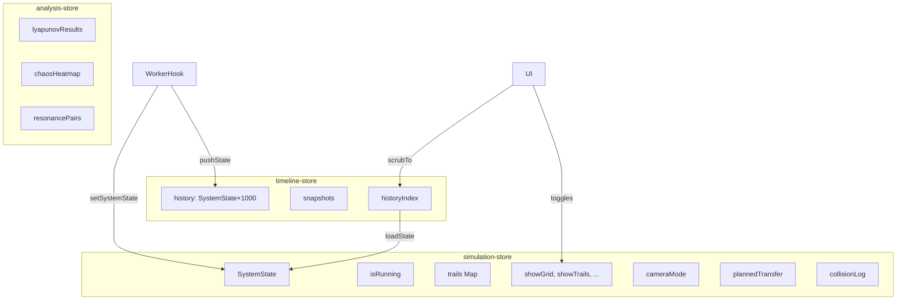

# Architecture — 3D N-Body Orbital Dynamics Lab

> Internal technical reference. For user-facing docs see [README.md](./README.md).

---

## High-Level Data Flow

```mermaid
graph LR
  Presets["Presets / Procedural Gen"] --> Store["Zustand Store"]
  Store -->|SystemState| WorkerHook["usePhysicsWorker"]
  WorkerHook -->|postMessage| Worker["physics.worker.ts<br/>(Web Worker)"]
  WorkerHook -->|stepGPU()| GPU["gpu-engine.ts<br/>(WebGPU Compute)"]
  Worker -->|RK4 + Octree + Collisions| Worker
  GPU -->|WGSL Leapfrog| GPU
  Worker -->|PhysicsStepResponse| WorkerHook
  GPU -->|SystemState| WorkerHook
  WorkerHook -->|setSystemState| Store
  Store -->|reactive| Scene["R3F Scene Graph"]
  Store -->|reactive| UI["UI Overlay Panels"]
  Scene --> Canvas["WebGL Canvas"]
  UI --> DOM["DOM Overlay"]
```

## Module Index

### `src/lib/physics/` — Physics Engine (worker-safe, zero DOM deps)

| File | Purpose |
|------|---------|
| `types.ts` | `Vector3D`, `CelestialBody`, `SystemState`, `EnergyMetrics` |
| `vector.ts` | Pure vector math (`add`, `sub`, `scale`, `dot`, `cross`, `length`, `clone`) |
| `rk4.ts` | 4th-order Runge-Kutta integrator, direct O(N²) acceleration, energy metrics |
| `octree.ts` | Barnes-Hut octree build + approximate force calculation (O(N log N)) |
| `collisions.ts` | Pairwise collision detection, inelastic merging (mass + momentum conservation) |
| `tidal-disruption.ts` | Roche-limit fragmentation — replaces a body with N shrapnel particles |
| `tidal.ts` | Hill sphere, Roche limit, and tidal acceleration calculations |
| `orbital-elements.ts` | State vector → six classical Keplerian elements + orbit classification |
| `gr-correction.ts` | Post-Newtonian (Schwarzschild) perturbative acceleration for GR precession |
| `lagrange.ts` | L1–L5 Lagrange point solver (Newton-Raphson for collinear, analytic for triangular) |
| `transfer-orbits.ts` | Hohmann, bi-elliptic, and Lambert solver for transfer orbit planning |
| `poincare.ts` | Poincaré section crossing detection in polar coordinates |
| `resonance.ts` | Mean-motion resonance detection + Kirkwood gap histogram |
| `lyapunov.ts` | Maximum Lyapunov exponent via shadow-trajectory divergence + renormalization |
| `gravitational-waves.ts` | Quadrupole-moment GW strain, polarizations, frequency, luminosity |
| `physics.worker.ts` | Web Worker entry — receives `PhysicsStepRequest`, runs RK4/octree/collisions/tidal, responds |
| `worker-protocol.ts` | TypeScript message types shared between main thread and worker |
| `analysis.worker.ts` | Background worker for Lyapunov, chaos heatmap, and other slow computations |
| `analysis-protocol.ts` | Message types for the analysis worker |

### `src/lib/physics/gpu/` — WebGPU Compute Backend

| File | Purpose |
|------|---------|
| `nbody-compute.wgsl` | WGSL compute shader — tiled N-body force summation + Leapfrog KDK integration |
| `gpu-engine.ts` | TypeScript wrapper: device init, buffer management, double-buffering, `stepGPU()` |
| `wgsl.d.ts` | Module declaration for `.wgsl` imports |

### `src/lib/stores/` — State Management (Zustand)

| File | Purpose |
|------|---------|
| `simulation-store.ts` | Central store: `SystemState`, run/pause, toggles, trails, camera mode, presets, planned transfers, collision log |
| `timeline-store.ts` | History ring buffer (1000 states), snapshot save/restore, scrub index |
| `analysis-store.ts` | Lyapunov results, chaos heatmap data, resonance pairs |

### `src/lib/presets/` — Scenario Definitions

| File | Purpose |
|------|---------|
| `index.ts` | Solar System, Binary Star, Figure-8, Lagrange Points, Galaxy Collision, Asteroid Belt, Mercury Precession, Real Solar System, Tidal Disruption Event |
| `black-holes.ts` | Black Hole Accretion, Binary Black Hole Inspiral |

### `src/lib/procedural/` — Procedural Generation

| File | Purpose |
|------|---------|
| `galaxy-generator.ts` | Density-wave spiral arms, Hernquist bulge, flat rotation curve, Kroupa IMF |
| `solar-system-generator.ts` | Titius-Bode spacing, log-uniform mass, Rayleigh eccentricity/inclination, moons |
| `random.ts` | Seeded PRNG (xoshiro128++) for reproducible generation |

### `src/lib/data/`

| File | Purpose |
|------|---------|
| `solar-system.ts` | High-fidelity Solar System ephemeris (Sun + 8 planets + Moon + Galilean moons + Pluto + Halley's Comet) |

### `src/lib/camera/`

| File | Purpose |
|------|---------|
| `camera-modes.ts` | Camera mode definitions (free, follow, top-down, flyby, co-rotating, cinematic dolly) |

### `src/lib/utils/`

| File | Purpose |
|------|---------|
| `orbital-velocity.ts` | Circular orbit, escape velocity, Hohmann Δv helpers |
| `export.ts` | CSV, JSON, PNG screenshot, WebM recording export |
| `share.ts` | Pako-compressed URL state encoding/decoding |
| `canvas-ref.ts` | Shared ref for the R3F canvas DOM element |

### `src/lib/scripting/` — User Scenario Scripting

| File | Purpose |
|------|---------|
| `sandbox.ts` | `Function()`-based sandbox with API injection, 5s timeout, 10K body cap |
| `run-script.ts` | Script execution coordinator |
| `script.worker.ts` | Worker entry for sandboxed script execution |
| `templates.ts` | Pre-loaded script templates (Ring, Random Cluster, Colliding Galaxies, etc.) |

### `src/lib/xr/`

| File | Purpose |
|------|---------|
| `xr-store.ts` | XR session state management |

### `src/hooks/` — React Hooks

| File | Purpose |
|------|---------|
| `usePhysicsWorker.ts` | Worker lifecycle, `requestAnimationFrame` loop, backpressure, GPU fallback, state sync |
| `useAnalysisWorker.ts` | Background analysis worker lifecycle (Lyapunov, chaos heatmap) |
| `useKeyboardShortcuts.ts` | Global keyboard shortcut handler (Space, R, G, T, 1–6, Esc, Delete, ?) |

### `src/components/scene/` — 3D Scene (React Three Fiber)

| Component | Purpose |
|-----------|---------|
| `Scene.tsx` | Root `<Canvas>` — lights, stars skybox, grid, post-processing, all child scene components |
| `Bodies.tsx` | `<InstancedMesh>` for 50+ bodies, individual `<Sphere>` below that, click/hover selection |
| `Trails.tsx` | Per-body orbit trails as `<Line>` with gradient opacity |
| `VelocityArrows.tsx` | Velocity vector arrows per body |
| `OrbitEllipse.tsx` | Predicted Keplerian orbit ellipse (dashed line, oriented by i/Ω/ω) |
| `CameraController.tsx` | Applies active camera mode in `useFrame` with lerped transitions |
| `SpacetimeGrid.tsx` | Deformable XZ plane vertex-displaced by gravitational potential (custom shader) |
| `HillSphere.tsx` | Translucent wireframe sphere at Hill radius |
| `RocheLimit.tsx` | Red ring at Roche limit distance with TIDAL DISRUPTION ZONE warning |
| `LagrangeMarkers.tsx` | L1–L5 diamond markers with stability coloring |
| `LaunchPreview.tsx` | Shift+click ghost sphere + drag arrow for slingshot body launch |
| `TransferArc.tsx` | Hohmann/Lambert transfer orbit arc visualization |
| `CollisionBursts.tsx` | Particle burst effect at collision points |
| `StarEffects.tsx` | `<Sparkles>` corona and `<Lensflare>` for star bodies |
| `BlackHole.tsx` | Event horizon sphere, photon sphere torus, accretion disk with Doppler shader |
| `LensingEffect.tsx` | Custom post-processing pass for gravitational lensing UV warp |
| `GWRipple.tsx` | Expanding concentric rings for gravitational wave fronts |
| `ResonanceWeb.tsx` | Colored arcs connecting resonant body pairs |
| `ChaosHeatmap.tsx` | 2D texture overlay of Lyapunov exponent grid |
| `TidalStream.tsx` | Stretched particle rendering for tidal debris |
| `XRScene.tsx` | WebXR wrapper — controllers, hand tracking, VR UI panels |

### `src/components/ui/` — DOM UI Panels

| Component | Purpose |
|-----------|---------|
| `ControlSidebar.tsx` | Left sidebar — simulation controls, view toggles, preset selector, physics options |
| `BodyInspector.tsx` | Right panel — selected body properties, orbital elements, editable fields |
| `BodyLauncher.tsx` | FAB + modal for adding new bodies with quick presets |
| `EnergyDashboard.tsx` | Bottom overlay — KE/PE/TE sparkline, angular momentum, drift warning |
| `TimelineBar.tsx` | Bottom scrub bar — history timeline, snapshot save/restore |
| `TransferPlanner.tsx` | Modal — Hohmann/bi-elliptic planner, Δv budget comparison |
| `ExportMenu.tsx` | Top-right dropdown — CSV, JSON, PNG, WebM, share link |
| `FormulaOverlay.tsx` | Contextual KaTeX-rendered physics formulas |
| `PhysicsTooltips.tsx` | Hover tooltips explaining physics quantities and units |
| `PhaseSpaceDiagram.tsx` | 2D canvas — Poincaré section + phase-space trajectory plots |
| `GWStrainPlot.tsx` | 2D canvas — real-time h₊/h× gravitational wave strain waveforms |
| `ResonancePanel.tsx` | Panel — resonance list + Kirkwood gap histogram |
| `ChaosIndicator.tsx` | Body inspector widget — Lyapunov exponent with stability coloring |
| `ScriptEditor.tsx` | Code editor for user-written JavaScript scenarios |
| `LoadingOverlay.tsx` | Spinning galaxy animation during hydration |
| `OnboardingTour.tsx` | First-visit 5-step tooltip sequence |
| `ShortcutsCheatsheet.tsx` | Keyboard shortcut modal (triggered by ?) |
| `EnterVrButton.tsx` | WebXR session entry button (hidden when unsupported) |
| `DisruptionToasts.tsx` | Toast notifications for tidal disruption events |

---

## Performance Architecture

### Body Count Scaling

| Range | Backend | Algorithm | Expected FPS |
|-------|---------|-----------|-------------|
| 1–50 | CPU Worker | Direct O(N²) RK4 | 60+ |
| 50–500 | CPU Worker | Barnes-Hut octree O(N log N) | 60 |
| 500–50,000 | WebGPU Compute | Brute-force tiled Leapfrog | 60 (GPU-dependent) |

### Rendering Optimization

- **Instanced meshes** for >50 bodies (single draw call)
- **`useFrame` + `getState()`** pattern — scene components read store imperatively inside the render loop, avoiding React re-renders from Zustand subscriptions
- **`React.memo`** on all scene components
- **Post-processing** (bloom, lensing) toggleable and auto-disabled at low FPS
- **Adaptive trail length** — halved when frame budget is exceeded

### Worker Backpressure

`usePhysicsWorker` tracks in-flight requests. A new request is only sent after the previous response arrives, preventing worker queue buildup that would otherwise cause input lag proportional to queue depth.

### Generation Counter

Each non-physics state mutation (preset load, timeline scrub, add/remove body) bumps a `generation` counter. Responses from stale generations are discarded, preventing a slow in-flight response from overwriting a freshly-loaded preset.

---

## State Management



---

## Build & Deploy

```
npm run dev          # Turbopack dev server
npm run build        # Production build (static export to out/)
npm run lint         # ESLint
npm run type-check   # tsc --noEmit (app + worker tsconfigs)
npm test             # Jest unit + integration tests
npm run test:coverage # Jest with coverage report
```

CI/CD: `.github/workflows/ci.yml` — lint → type-check → test → build → deploy to GitHub Pages on push to `main`.

---

## TypeScript Configuration

Two tsconfigs are required because the Web Worker runtime (`DedicatedWorkerGlobalScope`) conflicts with the DOM runtime (`window`, `document`):

| Config | Scope | `lib` |
|--------|-------|-------|
| `tsconfig.json` | App + components + stores + hooks | `dom`, `dom.iterable`, `esnext` |
| `tsconfig.worker.json` | `*.worker.ts` files | `webworker`, `esnext` |
| `tsconfig.test.json` | Jest test files | CommonJS module, jest types |

The worker protocol types (`worker-protocol.ts`, `analysis-protocol.ts`) are deliberately free of `webworker`-lib types so both compilations can import them.
