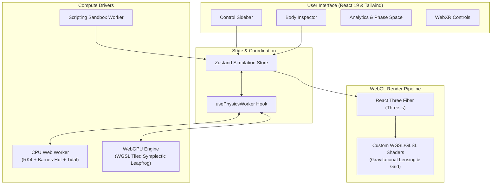

<div align="center">

# 🪐 3D N-Body Gravity & Orbital Dynamics Lab

### *What happens when you drop 10,000 stars into a binary black hole system?*

An interactive astrophysics sandbox in your browser. Powered by custom **RK4 & WebGPU integrators**, **Barnes-Hut octrees**, **General Relativity corrections**, **Tidal Disruption physics**, and **Poincaré chaos analysis**.

[**🚀 Launch Live Lab**](https://06navdeep06.github.io/N-Body-Gravity-Orbital-Dynamics-Lab/) • [**📖 Technical Architecture**](ARCHITECTURE.md) • [**🧪 Sandboxed Scripting**](#-sandbox-scripting-recipes)

---

[](https://github.com/06navdeep06/N-Body-Gravity-Orbital-Dynamics-Lab/actions)
[](https://opensource.org/licenses/MIT)
[](https://www.typescriptlang.org/)
[](https://www.w3.org/TR/webgpu/)
[](https://nextjs.org/)

</div>

---

## ⚡ Instant Preset Launchers

Click any preset below to launch the live simulation configured for that scenario:

| Simulation Preset | What to look for | Quick Launch |
| :--- | :--- | :---: |
| **🌀 Binary Black Hole Inspiral** | Gravitational wave chirp waveform ($h_+$, $h_\times$) + Doppler accretion | [▶ Run](https://06navdeep06.github.io/N-Body-Gravity-Orbital-Dynamics-Lab/?preset=binary-bh-inspiral) |
| **💥 Tidal Disruption Event** | Doomed star falling into supermassive black hole & shredding into tidal streams | [▶ Run](https://06navdeep06.github.io/N-Body-Gravity-Orbital-Dynamics-Lab/?preset=tidal-disruption) |
| **♾️ Figure-8 Choreography** | Three equal masses tracing Chenciner-Montgomery closed figure-8 loop | [▶ Run](https://06navdeep06.github.io/N-Body-Gravity-Orbital-Dynamics-Lab/?preset=figure-eight) |
| **🌌 Colliding Galaxies** | Two star clusters ($N=90$) with dark-matter bulge potential and tidal tails | [▶ Run](https://06navdeep06.github.io/N-Body-Gravity-Orbital-Dynamics-Lab/?preset=galaxy-collision) |
| **🪐 Asteroid Belt & Kirkwood Gaps** | Jupiter perturber carving 3:1 and 2:1 resonance gaps in 120 asteroids | [▶ Run](https://06navdeep06.github.io/N-Body-Gravity-Orbital-Dynamics-Lab/?preset=asteroid-belt) |
| **☀️ Real Solar System** | Accurate ephemeris: Sun, 8 planets, Moon, Galilean moons & Halley's Comet | [▶ Run](https://06navdeep06.github.io/N-Body-Gravity-Orbital-Dynamics-Lab/?preset=real-solar-system) |
| **☄️ Mercury GR Precession** | Schwarzschild post-Newtonian correction advancing Mercury's perihelion | [▶ Run](https://06navdeep06.github.io/N-Body-Gravity-Orbital-Dynamics-Lab/?preset=mercury-precession) |

---

## 🎮 Interactive Controls & Playground Challenges

### Controls
* **Shift + Drag**: Slingshot launch a custom celestial body with custom velocity.
* **Space**: Play / Pause simulation.
* **G**: Toggle Spacetime Curvature Grid (vertex-displaced gravitational potential well).
* **T**: Toggle Orbit Trails.
* **N**: Toggle Orbital Resonance Web.
* **W**: Toggle Real-Time Gravitational Wave Strain Waveform.
* **Ctrl + Shift + P**: Toggle Real-time Performance & Hardware Diagnostics.
* **?**: Open complete keyboard shortcut cheatsheet.

<details>
<summary><b>🏆 3 Mini Sandbox Challenges to Try</b></summary>

1. **The Slingshot Ejection**: Load *Mini Solar System*. Press `Shift` and drag behind Mars to launch a heavy Rogue Star into the inner solar system. Can you slingshot Earth out of orbit without colliding with the Sun?
2. **Black Hole Swimmer**: Load *Black Hole Accretion*. Enable `Roche Limits` (`R` key or UI toggle). Watch stars get torn apart once their radius crosses the red tidal boundary into debris streams.
3. **Resonance Hunter**: Load *Asteroid Belt*. Turn on `Resonance Web`. Watch how Jupiter's gravity sweeps asteroids away from the 3:1 and 2:1 orbital resonance zones over time.

</details>

---

## 🧪 Sandbox Scripting Recipes

The lab includes a sandboxed JavaScript code execution engine (running inside a dedicated, isolated Web Worker with a 5-second CPU limit and 10,000 body safety cap).

Copy and paste these snippets directly into the built-in **Script Editor** UI:

<details>
<summary><b>📜 Recipe 1: Build a Keplerian Ring Cluster</b></summary>

```js
// Create a massive central star
api.addBody({
  name: "Central Star",
  mass: 5000,
  position: [0, 0, 0],
  velocity: [0, 0, 0],
  color: "#fbbf24",
  radius: 3,
  isFixed: true
});

// Spawn 100 orbiting particles with exact circular Keplerian velocities
const N = 100;
for (let i = 0; i < N; i++) {
  const angle = (i / N) * Math.PI * 2;
  const radius = 12 + (i % 5) * 4;
  const v = api.circularOrbitVelocity(5000, radius); // √(GM/r)
  
  api.addBody({
    name: `Particle ${i}`,
    mass: 0.1,
    position: [radius * Math.cos(angle), 0, radius * Math.sin(angle)],
    velocity: [v * Math.sin(angle), 0, -v * Math.cos(angle)],
    color: "#60a5fa",
    radius: 0.2
  });
}

api.log(`Spawned ${N} particles in stable circular orbits!`);
```

</details>

<details>
<summary><b>📜 Recipe 2: Create a Gravitational Slingshot Encounter</b></summary>

```js
// Massive primary star
api.addBody({ name: "Primary", mass: 3000, position: [0, 0, 0], velocity: [0, 0, 0], color: "#f59e0b", radius: 2.5, isFixed: true });

// Heavy Jupiter analog
const vJup = api.circularOrbitVelocity(3000, 25);
api.addBody({ name: "Gas Giant", mass: 150, position: [25, 0, 0], velocity: [0, 0, -vJup], color: "#10b981", radius: 1.2 });

// Incoming high-speed comet targeting a gravity assist
api.addBody({ name: "Hyperbolic Comet", mass: 0.001, position: [-40, 0, 20], velocity: [12, 0, -4], color: "#ef4444", radius: 0.3 });

api.log("Comet incoming for gravity assist!");
```

</details>

---

## 🔬 Physics & Mathematics Reference

<details>
<summary><b>📐 1. Integrators & Barnes-Hut Octree</b></summary>

### 4th-Order Runge-Kutta (RK4)
$$\mathbf{y}_{n+1} = \mathbf{y}_n + \frac{\Delta t}{6} (\mathbf{k}_1 + 2\mathbf{k}_2 + 2\mathbf{k}_3 + \mathbf{k}_4)$$

Where derivatives evaluating trial accelerations $\mathbf{a} = \nabla U$ use Plummer-softened Newtonian gravity:
$$\mathbf{a}_i = G \sum_{j \neq i} \frac{m_j (\mathbf{r}_j - \mathbf{r}_i)}{(|\mathbf{r}_j - \mathbf{r}_i|^2 + \epsilon^2)^{3/2}}$$

### Barnes-Hut Multipole Criterion
An octree cell of width $s$ at distance $d$ is approximated as a single center of mass if:
$$\frac{s}{d} < \theta \quad (\text{default } \theta = 0.5)$$
Measured accuracy: **0.69% mean relative error** vs direct $O(N^2)$ force summation.

</details>

<details>
<summary><b>🌌 2. General Relativity & Black Hole Physics</b></summary>

### Post-Newtonian Schwarzschild Precession
Includes leading-order $1/c^2$ relativistic correction to Newtonian acceleration:
$$\mathbf{a}_{\text{GR}} = \mathbf{a}_{\text{Newton}} \left( 1 + \frac{3 G M}{c^2 r} \right)$$
Predicting exact perihelion advance per orbit:
$$\Delta\varpi = \frac{6\pi G M}{a c^2 (1 - e^2)}$$

### Quadrupole Gravitational Waves
Radiated strain tensor components ($h_+, h_\times$) and luminosity ($P_{GW}$):
$$h_{ij} = \frac{2G}{D c^4} \ddot{Q}_{ij}, \quad P_{GW} = \frac{G}{5 c^5} \left\langle \dddot{Q}_{ij} \dddot{Q}^{ij} \right\rangle$$

</details>

<details>
<summary><b>🌀 3. Tidal Disruption Physics (Roche Limit)</b></summary>

When a celestial body approaches a primary mass $M$, tidal disruption occurs when differential gravitational attraction exceeds self-gravitational binding:
$$\text{Roche Radius } r_{\text{Roche}} \approx 2.44 \, R_M \left( \frac{\rho_M}{\rho_m} \right)^{1/3}$$
Upon crossing $r_{\text{Roche}}$, the body is replaced by $N$ shrapnel particles possessing mass distributions obeying a power-law spectrum:
$$\frac{dN}{dm} \propto m^{-\alpha} \quad (\alpha \approx 1.8)$$

</details>

<details>
<summary><b>📈 4. Chaos Analysis (Lyapunov Exponents)</b></summary>

Dynamic chaos is measured using Benettin's method of shadow trajectory divergence with periodic renormalization:
$$\lambda = \lim_{T \to \infty} \frac{1}{T} \sum_{k=1}^{n} \ln \left( \frac{\|\mathbf{d}_k\|}{\delta_0} \right)$$
Positive $\lambda > 0$ indicates chaotic sensitivity to initial conditions (butterfly effect), whereas $\lambda \le 0$ indicates stable periodic/quasi-periodic orbits.

</details>

---

## 🏗️ Architecture & High-Performance Pipeline



---

## 🛠️ Local Development & Testing

### Prerequisites
* **Node.js**: `v20.x` or `v22.x`
* **Browser**: Chrome 113+, Edge 113+, or Firefox Nightly (for WebGPU compute shaders). *Automatic fallback to CPU Web Worker if WebGPU is unavailable.*

### Installation
```bash
git clone https://github.com/06navdeep06/N-Body-Gravity-Orbital-Dynamics-Lab.git
cd N-Body-Gravity-Orbital-Dynamics-Lab
npm install
```

### Dev Server
```bash
npm run dev
```
Open [http://localhost:3000](http://localhost:3000) in your browser.

### Test Suite Execution
The physics engine contains 112+ unit and integration tests verifying momentum conservation, Keplerian periods, Hohmann transfer delta-v budgets, and GR precession rates.

```bash
# Run full Jest test suite
npm test

# Run tests with coverage breakdown
npm run test:coverage

# Perform strict TypeScript type checking across DOM & Worker targets
npm run type-check
```

---

## 📜 License

Distributed under the **MIT License**. See `LICENSE` for details.

Developed with ❤️ for space enthusiasts, physics lovers, and WebGL graphics engineers.
