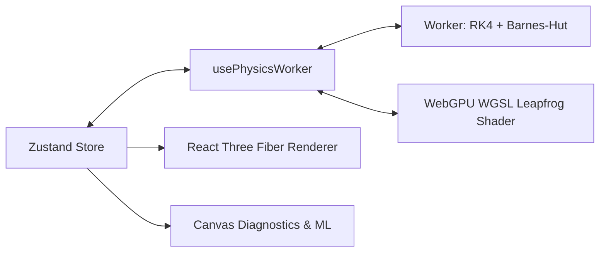

# 3D N-Body Gravity & Orbital Dynamics Lab

High-performance gravitational N-body simulator running in-browser via WebGPU compute shaders, Barnes-Hut octree decomposition, 4th-order Runge-Kutta integration, and post-Newtonian general relativity corrections.

[Live Sandbox](https://06navdeep06.github.io/N-Body-Gravity-Orbital-Dynamics-Lab/) | [Architecture Spec](ARCHITECTURE.md)

---

## Preset Quick Launchers

| Preset Scenario | Dynamics & Physics Surface | Launch |
| :--- | :--- | :---: |
| **Binary Black Hole Inspiral** | Gravitational wave quadrupole strain ($h_+$, $h_\times$) and Doppler accretion | [Run](https://06navdeep06.github.io/N-Body-Gravity-Orbital-Dynamics-Lab/?preset=binary-bh-inspiral) |
| **Tidal Disruption Event** | Roche-limit tidal shredding into power-law debris streams | [Run](https://06navdeep06.github.io/N-Body-Gravity-Orbital-Dynamics-Lab/?preset=tidal-disruption) |
| **Figure-8 Choreography** | Chenciner-Montgomery 3-body equal-mass periodic orbit | [Run](https://06navdeep06.github.io/N-Body-Gravity-Orbital-Dynamics-Lab/?preset=figure-eight) |
| **Galaxy Collision** | Dual star clusters ($N=90$) with Hernquist core potential | [Run](https://06navdeep06.github.io/N-Body-Gravity-Orbital-Dynamics-Lab/?preset=galaxy-collision) |
| **Asteroid Belt & Resonances** | Jupiter perturber carving 3:1 and 2:1 Kirkwood gaps | [Run](https://06navdeep06.github.io/N-Body-Gravity-Orbital-Dynamics-Lab/?preset=asteroid-belt) |
| **Real Solar System** | Full ephemeris: Sun, 8 planets, Moon, Galilean moons, Halley's comet | [Run](https://06navdeep06.github.io/N-Body-Gravity-Orbital-Dynamics-Lab/?preset=real-solar-system) |
| **Mercury GR Precession** | Schwarzschild post-Newtonian perihelion advance | [Run](https://06navdeep06.github.io/N-Body-Gravity-Orbital-Dynamics-Lab/?preset=mercury-precession) |

---

## Technical Specifications

<details>
<summary><b>Integrators & Force Decomposition</b></summary>

### RK4 Integrator
$$\mathbf{y}_{n+1} = \mathbf{y}_n + \frac{\Delta t}{6} (\mathbf{k}_1 + 2\mathbf{k}_2 + 2\mathbf{k}_3 + \mathbf{k}_4)$$

Acceleration calculation uses Plummer-softened Newtonian gravity:
$$\mathbf{a}_i = G \sum_{j \neq i} \frac{m_j (\mathbf{r}_j - \mathbf{r}_i)}{(|\mathbf{r}_j - \mathbf{r}_i|^2 + \epsilon^2)^{3/2}}$$

### Barnes-Hut Multipole Opening Criterion
Cell of width $s$ at distance $d$ is approximated as a single point mass when $s/d < \theta$ ($\theta = 0.5$, yielding 0.69% mean relative error vs $O(N^2)$ direct sum).

</details>

<details>
<summary><b>Relativity, Waves & Chaos Analysis</b></summary>

### Schwarzschild Post-Newtonian Precession
$$\mathbf{a}_{\text{GR}} = \mathbf{a}_{\text{Newton}} \left( 1 + \frac{3 G M}{c^2 r} \right) \implies \Delta\varpi = \frac{6\pi G M}{a c^2 (1 - e^2)}$$

### Gravitational Wave Strain & Luminosity
$$h_{ij} = \frac{2G}{D c^4} \ddot{Q}_{ij}, \quad P_{GW} = \frac{G}{5 c^5} \left\langle \dddot{Q}_{ij} \dddot{Q}^{ij} \right\rangle$$

### Benettin Lyapunov Exponent
$$\lambda = \lim_{T \to \infty} \frac{1}{T} \sum_{k=1}^{n} \ln \left( \frac{\|\mathbf{d}_k\|}{\delta_0} \right)$$

</details>

---

## System Architecture



---

## Scripting Sandbox API

Scripts execute in a dedicated, isolated Web Worker (5s CPU budget, 10,000 body cap).

```js
// Keplerian Ring Generator
api.addBody({ name: "Star", mass: 5000, position: [0, 0, 0], velocity: [0, 0, 0], color: "#fbbf24", radius: 3, isFixed: true });

for (let i = 0; i < 60; i++) {
  const angle = (i / 60) * Math.PI * 2;
  const r = 15 + (i % 4) * 3;
  const v = api.circularOrbitVelocity(5000, r);
  api.addBody({
    name: `Body ${i}`,
    mass: 0.1,
    position: [r * Math.cos(angle), 0, r * Math.sin(angle)],
    velocity: [v * Math.sin(angle), 0, -v * Math.cos(angle)],
    color: "#60a5fa", radius: 0.2
  });
}
```

---

## Controls

* **Shift + Drag**: Slingshot launch body
* **Space**: Play / Pause
* **G**: Toggle Spacetime Curvature Grid
* **T**: Toggle Orbit Trails
* **N**: Toggle Resonance Web
* **W**: Toggle Gravitational Wave Strain Plot
* **Ctrl + Shift + P**: Toggle Hardware Profiler
* **?**: Keyboard Cheatsheet

---

## Local Environment & Test Suite

```bash
npm install
npm run dev          # Start local dev server (http://localhost:3000)
npm test             # Run 112 Jest physics unit & integration tests
npm run type-check   # Validate TypeScript compilation across app & worker scopes
```

## License

MIT
