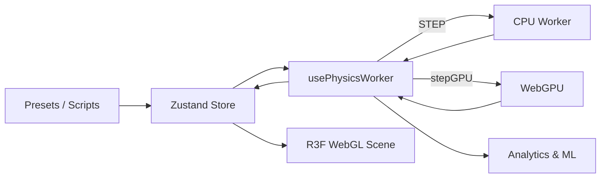

<div align="center">

# 🌌 N-Body Orbital Dynamics Lab

**A research-grade gravitational N-body simulator running entirely in the browser.**

[](https://github.com/06navdeep06/N-Body-Gravity-Orbital-Dynamics-Lab/actions)
[](https://opensource.org/licenses/MIT)
[](https://www.typescriptlang.org/)
[](https://www.w3.org/TR/webgpu/)
[](https://nextjs.org/)

[**Live Demo**](https://06navdeep06.github.io/N-Body-Gravity-Orbital-Dynamics-Lab/) • [**Architecture**](ARCHITECTURE.md)

</div>

---

> **Mission:** Deliver a high-performance astrophysics sandbox to the web. No backend. No installation. No data leaves the page. From Keplerian transfers to general relativity, tidal shredding, and chaos theory—all calculated locally in real-time.

---

## ⚡ Core Engine

| Subsystem | Implementation |
|---|---|
| **Integrator (CPU)** | 4th-order Runge-Kutta (RK4) with configurable Plummer softening ε and adaptive energy-drift step control. |
| **Integrator (GPU)** | WebGPU compute path executing a tiled Leapfrog (symplectic) WGSL shader for massive N-body scaling (10,000+ bodies). |
| **Force Evaluation** | Barnes-Hut octree yielding `O(N log N)` scaling. Validated accuracy: 0.69% mean relative error at θ = 0.5 vs brute force. |
| **Collisions** | Inelastic merging algorithms rigorously conserving total mass, system momentum, and body volume. |
| **Tidal Forces** | Bodies crossing a primary's Roche limit are procedurally shredded into a power-law fragment cloud, dynamically forming tidal tails. |

---

## 🔭 Advanced Astrophysics & Analysis

- **General Relativity (GR):** Post-Newtonian (Schwarzschild) perturbation for accurate periapsis advance simulation.
- **Chaos Quantification:** Maximum Lyapunov exponent extraction via Benettin renormalization, rendered via progressive background-worker chaos maps.
- **Phase Space:** Real-time Poincaré sections and phase-space trajectory plotting.
- **Resonances:** Active detection of Mean-Motion Resonances with Kirkwood-gap histograms.
- **Gravitational Waves:** Quadrupole approximation calculating $h_+$, $h_\times$, frequency, and radiated power ($P_{GW}$).
- **Lagrange Solvers:** L1–L5 point solvers leveraging bisection-safeguarded Newton-Raphson methods.

---

## 🎥 Visualization & XR

- **Black Holes:** Event horizons, photon spheres, and Doppler-beamed procedural accretion disks paired with screen-space gravitational lensing.
- **Spacetime Grid:** Vertex-displaced shader mapping gravitational potential wells across the XZ plane.
- **Orbital UI:** Predicted orbit ellipses, Hill spheres, Roche limit rings, velocity vectors, and gradient trails.
- **WebXR (VR):** Fully integrated Virtual Reality mode with ray-selection and grab-and-throw mechanics.
- **Cinematics:** Six distinct camera modes including co-rotating frames and cinematic dolly interpolation.

---

## 🛠 Scripting & Interactivity

- **Hohmann & Lambert Planners:** Interactive UI for orbital transfer planning, execution, and Δv budget analysis.
- **Scripting Sandbox:** Write JavaScript scenarios inside a strict, terminable Web Worker sandbox (5s budget, 10K body limits).
- **Procedural Generation:** Instantly spin up spiral galaxies (with flat rotation curves) or Titius-Bode constrained solar systems.
- **Accessibility & ML:** Screen-reader live regions, colorblind-safe palettes (Okabe-Ito), 5-language i18n, and TensorFlow.js predictive ML models.

---

## 🚀 Quick Start

**Requirements:** Node 22+. Any modern browser (Chrome 113+ / Edge 113+ required for WebGPU acceleration; CPU worker fallback is automatic).

```bash
# Clone and install dependencies
git clone https://github.com/06navdeep06/N-Body-Gravity-Orbital-Dynamics-Lab.git
cd N-Body-Gravity-Orbital-Dynamics-Lab
npm install

# Start the development server
npm run dev
```
Open [http://localhost:3000](http://localhost:3000)

### Testing & Validation
The physics engine is ruthlessly validated against analytic results (not snapshots). 
```bash
npm test             # Run 112 tests across 10 suites
npm run lint         # ESLint strict validation
npm run type-check   # tsc validation (DOM & WebWorker scopes)
```

---

## 🧠 Physics Reference

<details>
<summary><b>View Equations & Algorithms</b></summary>

**Newtonian gravity** with Plummer softening $\epsilon$, which removes the singularity at $r \to 0$:
$$F_{ij} = \frac{G \cdot m_i \cdot m_j \cdot (r_j - r_i)}{(|r_j - r_i|^2 + \epsilon^2)^{3/2}}$$

**Vis-viva** — speed anywhere on a conic of semi-major axis $a$:
$$v^2 = GM \left(\frac{2}{r} - \frac{1}{a}\right)$$

**Roche limit** (fluid body) and **Hill radius**:
$$d_{Roche} = 2.44 \cdot R_M \left(\frac{\rho_M}{\rho_m}\right)^{1/3} \quad\quad r_{Hill} = a \left(\frac{m}{3M}\right)^{1/3}$$

**GR perihelion advance** per orbit (leading post-Newtonian order):
$$\Delta\varpi = \frac{6\pi GM}{a c^2 (1 - e^2)}$$

**Maximum Lyapunov exponent** (Benettin, with periodic renormalization):
$$\lambda = \frac{1}{T} \sum \ln\left(\frac{d_k}{\delta}\right)$$

</details>

---

## ⌨️ Keyboard Shortcuts

| Key | Action | Key | Action |
|---|---|---|---|
| `Space` | Play / pause | `W` | Toggle GW strain |
| `R` | Reset current preset | `1`–`9` | Load preset N |
| `G` | Toggle spacetime grid | `Esc` | Deselect / close dialogs |
| `T` | Toggle trails | `Del` | Remove selected body |
| `N` | Toggle resonances | `Shift`+Drag | Slingshot-launch body |
| `Ctrl+Shift+P`| Performance profiler | `?` | Show shortcuts |

---

## 🏛 Architecture

Fully client-side. Physics runs in Web Workers or a WebGPU pipeline; state lives in Zustand stores; rendering is React Three Fiber.
For full details, read [**ARCHITECTURE.md**](ARCHITECTURE.md).



## 📝 License
[MIT](LICENSE)
