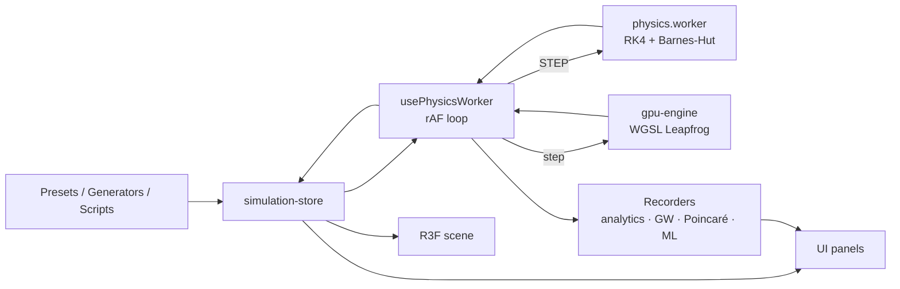

# N-Body Orbital Dynamics Lab

A research-grade gravitational N-body simulator that runs entirely in the
browser — RK4 and symplectic GPU integrators, Keplerian orbit analysis,
chaos quantification, relativistic precession, black-hole rendering, and a
scripting sandbox for building your own scenarios.

No backend, no install, no data leaves the page.

```bash
npm install && npm run dev
```

---

## Features

### Physics
- **RK4 integrator** with configurable timestep, softening and adaptive
  step control driven by measured energy drift.
- **Barnes-Hut octree** — O(N log N) force evaluation. Measured accuracy at
  θ = 0.5: **0.69% mean / 0.39% median** relative error vs. brute force.
- **WebGPU compute path** — tiled Leapfrog (symplectic) in WGSL for large N,
  with silent fallback to the CPU worker.
- **Collisions** — inelastic merging conserving mass, momentum and volume.
- **Tidal disruption** — bodies crossing a heavy body's Roche limit shred
  into a power-law fragment cloud that forms leading/trailing tidal tails
  through ordinary N-body evolution.
- **GR precession** — leading-order post-Newtonian (Schwarzschild)
  correction, validated against the analytic perihelion-advance rate.
- **Lagrange points** L1–L5 via bisection-safeguarded Newton-Raphson.

### Analysis
- **Keplerian orbital elements** from the instantaneous state vector.
- **Lyapunov exponents** (Benettin renormalization) with a chaos
  classification that accounts for finite-time artifacts.
- **Chaos maps** — Lyapunov exponent over a grid of launch conditions,
  streamed progressively from a background worker.
- **Poincaré sections** and phase-space trajectories.
- **Mean-motion resonances** and Kirkwood-gap histograms.
- **Gravitational-wave strain** in the quadrupole approximation — h₊, h×,
  frequency and radiated power, validated to 0.2% against theory.
- **Analytics dashboard** — 8 chart types on a from-scratch canvas charting
  layer, with CSV export.

### Visualization
- Spacetime curvature grid (vertex-displaced shader), Hill spheres, Roche
  limits, predicted orbit ellipses, velocity arrows, orbit trails.
- **Black holes** — event horizon, photon sphere, Doppler-beamed procedural
  accretion disk, screen-space gravitational lensing.
- Collision particle bursts, star coronas and procedural lens flares.
- Six camera modes including a co-rotating frame and cinematic dolly.

### Interactivity
- Shift-drag **slingshot launcher** for new bodies.
- **Transfer planner** — Hohmann, bi-elliptic and Lambert solutions with a
  Δv budget comparison and executable burns.
- **Timeline scrubbing** and named snapshots.
- **Scripting sandbox** — build scenarios in JavaScript, run in a terminable
  worker with a 5 s budget and a 10,000-body cap.
- **Procedural generation** — spiral galaxies with flat rotation curves,
  random star systems with Titius-Bode spacing and Hill-constrained moons.
- **WebXR** VR mode with controller ray-select and grab-and-throw.

### Education & access
- KaTeX formula overlays, contextual physics tooltips, onboarding tour.
- Full **keyboard control** with a `?` cheatsheet.
- **Accessibility**: screen-reader live regions, `prefers-reduced-motion`,
  `prefers-contrast`, and an Okabe-Ito colour-blind palette.
- **Five languages**: English, Spanish, German, Japanese, Hindi.

---

## Getting started

**Requirements:** Node 18+ (CI uses 22). Any modern browser; WebGPU
(Chrome 113+ / Edge 113+) unlocks the GPU compute path but is not required.

```bash
npm install
npm run dev          # http://localhost:3000

npm run lint         # ESLint
npm run type-check   # app + worker TypeScript programs
npm test             # Jest
npm run test:coverage
npm run build        # static export to ./out
```

### Environment variables

Copy `.env.example` to `.env.local`:

| Variable | Purpose |
|---|---|
| `NEXT_PUBLIC_BASE_PATH` | Subdirectory prefix for hosting (GitHub Pages project sites). Empty for root. |
| `NEXT_PUBLIC_WS_URL` | Reserved for collaborative sessions. **Currently unused** — see [Not implemented](#not-implemented). |

---

## Architecture

Fully client-side. Physics runs in Web Workers or a WebGPU pipeline; state
lives in Zustand stores; rendering is React Three Fiber.



Full detail — module graph, worker protocols, rendering pipeline, file
index — is in **[ARCHITECTURE.md](ARCHITECTURE.md)**.

### Tech stack

| Package | Version | Role |
|---|---|---|
| next | 16.2 | App Router, static export |
| react / react-dom | 19.2 | UI |
| three | 0.185 | WebGL renderer |
| @react-three/fiber | 9.6 | React renderer for three |
| @react-three/drei | 10.7 | scene helpers |
| @react-three/postprocessing | 3.0 | lensing pass |
| @react-three/xr | 6.6 | WebXR |
| @tensorflow/tfjs | 4.22 | ML predictor (lazy-loaded) |
| zustand | 5.0 | state |
| katex | 0.18 | formula rendering |
| pako | 3.0 | share-link compression |
| jest / ts-jest | 30 / 29 | tests |

---

## Physics reference

**Newtonian gravity** with Plummer softening ε, which removes the
singularity at r → 0:

```
F_ij = G · m_i · m_j · (r_j − r_i) / (|r_j − r_i|² + ε²)^(3/2)
```

**Vis-viva** — speed anywhere on a conic of semi-major axis a:

```
v² = GM (2/r − 1/a)
```

**Barnes-Hut opening criterion** — a node of size s at distance d is treated
as a point mass when `s/d < θ`. A node *containing* the body is always
opened, or the body's own mass would act on itself.

**Roche limit** (fluid body) and **Hill radius**:

```
d_Roche = 2.44 · R_M · (ρ_M / ρ_m)^(1/3)
r_Hill  = a · (m / 3M)^(1/3)
```

**Tidal disruption** fires only when the tidal field across the body beats
its own surface gravity:

```
a_tidal = 2GMR / d³   >   a_self = Gm / R²
```

**GR perihelion advance** per orbit (leading post-Newtonian order):

```
Δϖ = 6πGM / (a c² (1 − e²))
```

**Gravitational-wave strain** in the quadrupole approximation:

```
Q_ij = Σ_k m_k (3 x_i x_j − δ_ij |r|²)
h_ij = (2G / D c⁴) · Q̈_ij
P_GW = (G / 5c⁵) · ⟨ Q⃛_ij Q⃛^ij ⟩
```

**Maximum Lyapunov exponent** (Benettin, with periodic renormalization):

```
λ = (1/T) · Σ ln(d_k / δ)
```

Reported over the *second half* of the integration: for a regular orbit the
accumulated log-stretching grows like ln(T), so the late-window rate decays
toward zero, while genuine chaos holds a steady positive rate. The window is
auto-sized to ~24 orbits of the target — chaos measured over a fraction of
one orbit is meaningless.

---

## Keyboard shortcuts

| Key | Action |
|---|---|
| `Space` | Play / pause |
| `R` | Reset current preset |
| `G` | Toggle spacetime grid |
| `T` | Toggle trails |
| `N` | Toggle resonances |
| `W` | Toggle GW strain |
| `1`–`9` | Load preset N |
| `Esc` | Deselect body / close dialogs |
| `Delete` | Remove selected body |
| `Shift` + drag | Slingshot-launch a new body |
| `?` | Toggle shortcut cheatsheet |
| `Ctrl+Shift+P` | Toggle performance profiler |

---

## Scripting API

Scripts run in a worker with no DOM and no network, a 5-second budget and a
10,000-body cap.

```js
api.addBody({
  name, mass,
  position: [x, y, z],
  velocity: [vx, vy, vz],
  color, radius,
  isFixed, isBlackHole,
});

api.removeBody(nameOrId);
api.setG(value);
api.setSoftening(value);
api.setTimeStep(value);
api.circularOrbitVelocity(centralMass, radius);  // √(GM/r)
api.escapeVelocity(centralMass, distance);       // √(2GM/r)
api.bodyCount;
api.log(...args);
```

`Math` is available. `window`, `document`, `fetch`, storage and timers are
not. Built-in templates cover rings, Gaussian clusters, colliding galaxies,
the Pythagorean three-body problem and a Broucke periodic orbit.

---

## Testing

135 tests across 11 suites. **93.8% statements / 97.5% lines** on
`src/lib/physics/`, gated at 80% in CI.

Tests assert against analytic results wherever one exists — Kepler periods,
Hohmann Δv against published Earth→Mars values, the Schwarzschild precession
rate, Sun–Earth L1 at one Hill radius. That approach found three real bugs
that had shipped: a sign error in the Lagrange L1 derivative, an octree
stack overflow on coincident bodies, and an octree self-mass leak.

---

## Deployment

`npm run build` produces a static export in `out/`. CI lints, type-checks
both TypeScript programs, runs tests with the coverage gate, builds, and
deploys to GitHub Pages.

For a **project site** (`user.github.io/repo`), `NEXT_PUBLIC_BASE_PATH` must
be `/repo` or every asset 404s. The workflow derives this automatically.

Manual deploy: `npm run build && npm run deploy`.

---

## Not implemented

Stated plainly so the feature list above can be trusted:

- **Real-time multiplayer.** Requires a long-lived WebSocket server, which
  Next.js App Router route handlers cannot host. `NEXT_PUBLIC_WS_URL` is
  reserved for it but nothing reads it.
- **JPL Horizons live fetch.** The Solar System preset uses a curated
  offline dataset with real masses and orbital elements.
- **Audio sonification.**
- **Sub-768px responsive layout.** Keyboard accessibility is complete; the
  panel-collapse breakpoint is not.

### Verified vs. unverified

| Area | Status |
|---|---|
| CPU physics, analysis, generators | Unit-tested against analytic results |
| UI, static export | Driven in headless Chromium, zero console errors |
| **WebGPU compute path** | **Unverified on real hardware** — headless Chromium exposes no adapter. The WGSL compiles and the CPU fallback is exercised, but the 10k-body performance claim is untested. |
| **WebXR** | **Untested** — no headset. Only graceful degradation was confirmed. |
| ML predictor | Trains and predicts; accuracy is not competitive with RK4 by design |

---

## Contributing

1. `npm install`
2. Make your change.
3. `npm run lint && npm run type-check && npm test` — all three must pass.
4. Physics changes need a test asserting against an analytic result, not a
   recorded snapshot.
5. Scene components that own GPU buffers must follow the ref-in-effect
   pattern described in ARCHITECTURE.md §5 — the React Compiler lint rules
   reject mutating `useMemo`/`useState` values after render.

---

## License

MIT
